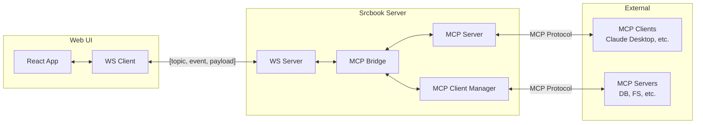
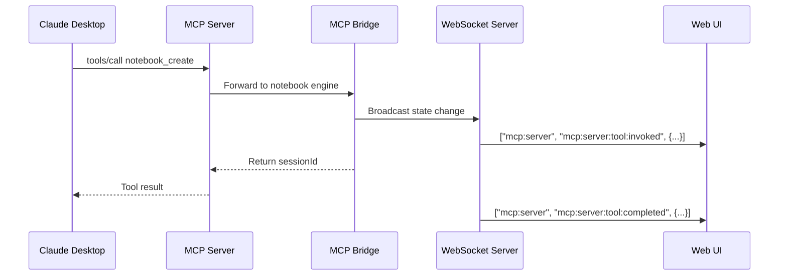
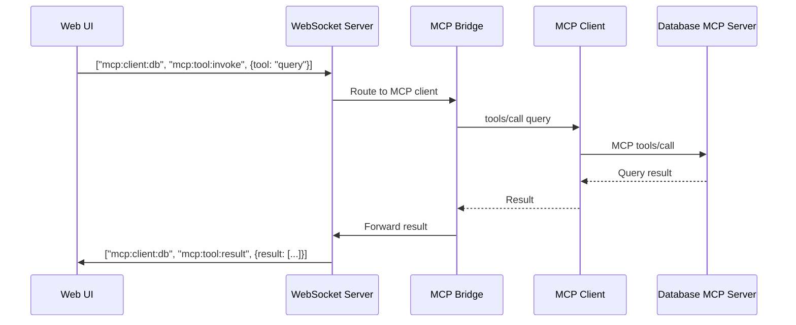

# MCP Foundation Specification

**Version:** 1.0.0
**Date:** 2026-01-13
**Status:** Draft
**Author:** AI-assisted via @loops/authoring/spec-drafting
**Depends on:** None
**Source:** `docs/mcp-integration-spec.md`, `docs/README-MCP.md`

---

## Table of Contents

1. [Problem Statement](#1-problem-statement)
2. [Constraints & Assumptions](#2-constraints--assumptions)
3. [Architecture Overview](#3-architecture-overview)
4. [Component Design](#4-component-design)
5. [Data Model](#5-data-model)
6. [Integration Points](#6-integration-points)
7. [Trade-off Analysis](#7-trade-off-analysis)
8. [Risk Assessment](#8-risk-assessment)
9. [Acceptance Criteria](#9-acceptance-criteria)
10. [Glossary](#10-glossary)

---

## 1. Problem Statement

Srcbook currently operates as a standalone TypeScript/JavaScript notebook platform. To become "agent-first" and participate in the broader AI tool ecosystem, Srcbook needs to:

1. **Expose** its notebook capabilities to external AI agents (Claude Desktop, VS Code, custom agents)
2. **Consume** capabilities from external services (databases, file systems, APIs) through a standardized protocol

The Model Context Protocol (MCP) provides the standardized interface to achieve both goals.

### Goals

| ID | Goal | Priority | Rationale |
|----|------|----------|-----------|
| G-001 | Enable AI agents to autonomously control notebooks | Must | Core value proposition |
| G-002 | Allow notebooks to leverage external MCP servers | Must | Extend notebook capabilities |
| G-003 | Maintain backward compatibility | Must | Don't break existing users |
| G-004 | Support human-in-the-loop workflows | Should | Safety and control |
| G-005 | Enable multi-agent collaboration | Could | Future enhancement |

### Non-Goals

- Implementing custom protocols (use MCP standard only)
- Supporting MCP protocol versions before 2025-11-25
- Building MCP servers for external services (use existing ecosystem)

---

## 2. Constraints & Assumptions

### Constraints

| ID | Constraint | Impact | Mitigation |
|----|------------|--------|------------|
| C-001 | MCP protocol version 2025-11-25 | Must implement specific capabilities | Pin SDK version |
| C-002 | Existing Srcbook API surface | Cannot break public APIs | Add new endpoints, don't modify |
| C-003 | TypeScript runtime only | No Python/other notebook types | Document limitation |
| C-004 | Single-user local deployment | No multi-tenant considerations | Simplify security model |

### Assumptions

| ID | Assumption | Risk if False | Validation |
|----|------------|---------------|------------|
| A-001 | MCP SDK is production-ready | High—need alternative | Review SDK maturity |
| A-002 | External MCP servers are trusted | Medium—security gaps | Implement allowlist |
| A-003 | Users understand MCP concepts | Low—UX confusion | Provide good docs |
| A-004 | Network latency acceptable for sync operations | Medium—poor UX | Add async patterns |

---

## 3. Architecture Overview

### Dual-Role Architecture

Srcbook implements bidirectional MCP integration:

```
┌─────────────────────────────────────────────────────────────────┐
│                      Srcbook Application                         │
│                                                                  │
│  ┌────────────────────┐       ┌───────────────────────┐        │
│  │    MCP Client      │◄──────┤    Core Notebook      │        │
│  │    (Consumer)      │       │       Engine          │        │
│  └────────┬───────────┘       └───────────┬───────────┘        │
│           │                               │                     │
│           │                               ▼                     │
│           │                   ┌───────────────────────┐        │
│           │                   │      MCP Server       │        │
│           │                   │      (Provider)       │        │
│           │                   └───────────┬───────────┘        │
│           │                               │                     │
└───────────┼───────────────────────────────┼─────────────────────┘
            │                               │
            ▼                               ▼
    External MCP Servers            External MCP Clients
    (Database, Files, APIs)         (Claude, VS Code, Agents)
```

### Component Hierarchy

```
srcbook/
├── packages/
│   ├── mcp-server/           # MCP Server Implementation
│   │   ├── src/
│   │   │   ├── server.ts     # Main server entry
│   │   │   ├── tools/        # Tool implementations
│   │   │   ├── resources/    # Resource providers
│   │   │   └── prompts/      # Prompt templates
│   │   └── package.json
│   │
│   ├── mcp-client/           # MCP Client Implementation
│   │   ├── src/
│   │   │   ├── client.ts     # Client manager
│   │   │   ├── registry.ts   # Capability registry
│   │   │   └── transports/   # Transport implementations
│   │   └── package.json
│   │
│   └── api/                  # Existing Srcbook API
│       └── mcp/              # MCP integration layer
│           ├── bridge.ts     # Core ↔ MCP bridge
│           └── config.ts     # Configuration
```

---

## 4. Component Design

### 4.1 MCP Server Component

**Purpose:** Expose Srcbook operations to external MCP clients

**Responsibilities:**
- Handle MCP protocol messages
- Route tool invocations to notebook engine
- Serve resource content
- Return prompt templates

**Interfaces:**

```typescript
// packages/mcp-server/src/types.ts

export interface SrcbookMCPServer {
  // Lifecycle
  start(): Promise<void>;
  stop(): Promise<void>;

  // Capabilities
  getCapabilities(): ServerCapabilities;

  // Tool handling
  handleToolCall(name: string, args: unknown): Promise<ToolResult>;

  // Resource serving
  handleResourceRead(uri: string): Promise<ResourceContent>;
  handleResourceSubscribe(uri: string): Subscription;

  // Prompt serving
  handlePromptGet(name: string, args: Record<string, string>): Promise<PromptContent>;
}

export interface ServerCapabilities {
  tools: { listChanged: boolean };
  resources: { subscribe: boolean; listChanged: boolean };
  prompts: { listChanged: boolean };
}
```

### 4.2 MCP Client Component

**Purpose:** Connect to and consume external MCP servers

**Responsibilities:**
- Manage server connections
- Discover and registry capabilities
- Invoke external tools
- Access external resources

**Interfaces:**

```typescript
// packages/mcp-client/src/types.ts

export interface SrcbookMCPClient {
  // Connection management
  connect(config: MCPServerConfig): Promise<string>;  // Returns connectionId
  disconnect(connectionId: string): Promise<void>;
  listConnections(): ConnectionInfo[];

  // Tool operations
  listTools(): Tool[];
  invokeTool(connectionId: string, name: string, args: unknown): Promise<ToolResult>;

  // Resource operations
  listResources(): Resource[];
  readResource(connectionId: string, uri: string): Promise<ResourceContent>;
  subscribeResource(connectionId: string, uri: string, callback: ResourceCallback): Subscription;

  // Sampling (optional)
  sample(request: SamplingRequest): Promise<SamplingResponse>;
}

export interface MCPServerConfig {
  id: string;
  name: string;
  transport: 'stdio' | 'http';

  // stdio transport
  command?: string;
  args?: string[];
  env?: Record<string, string>;

  // http transport
  url?: string;
  headers?: Record<string, string>;

  // Settings
  autoConnect: boolean;
  enabled: boolean;
}
```

### 4.3 Integration Bridge

**Purpose:** Connect MCP layer with core Srcbook engine

**Responsibilities:**
- Translate MCP operations to Srcbook API calls
- Manage state synchronization
- Handle capability negotiation

```typescript
// packages/api/mcp/bridge.ts

export interface MCPBridge {
  // Server-side (Srcbook → External)
  registerToolHandlers(server: SrcbookMCPServer): void;
  registerResourceProviders(server: SrcbookMCPServer): void;

  // Client-side (External → Srcbook)
  exposeToolsToNotebook(sessionId: string): NotebookMCPContext;

  // State sync
  onNotebookChange(sessionId: string, callback: ChangeCallback): Unsubscribe;
}
```

---

## 5. Data Model

### 5.1 Database Schema Extensions

```sql
-- MCP server connection configuration
CREATE TABLE mcp_servers (
  id TEXT PRIMARY KEY,
  name TEXT NOT NULL,
  transport TEXT NOT NULL CHECK (transport IN ('stdio', 'http')),
  config JSON NOT NULL,
  enabled BOOLEAN DEFAULT true,
  last_connected TIMESTAMP,
  created_at TIMESTAMP DEFAULT CURRENT_TIMESTAMP,
  updated_at TIMESTAMP DEFAULT CURRENT_TIMESTAMP
);

-- MCP tool invocation history (for auditing)
CREATE TABLE mcp_tool_invocations (
  id INTEGER PRIMARY KEY AUTOINCREMENT,
  session_id TEXT NOT NULL,
  server_id TEXT,  -- NULL for Srcbook's own tools
  tool_name TEXT NOT NULL,
  input JSON NOT NULL,
  output JSON,
  error TEXT,
  duration_ms INTEGER,
  created_at TIMESTAMP DEFAULT CURRENT_TIMESTAMP,
  FOREIGN KEY (session_id) REFERENCES sessions(id) ON DELETE CASCADE
);

-- Active resource subscriptions
CREATE TABLE mcp_resource_subscriptions (
  id INTEGER PRIMARY KEY AUTOINCREMENT,
  session_id TEXT NOT NULL,
  server_id TEXT NOT NULL,
  resource_uri TEXT NOT NULL,
  active BOOLEAN DEFAULT true,
  created_at TIMESTAMP DEFAULT CURRENT_TIMESTAMP,
  FOREIGN KEY (session_id) REFERENCES sessions(id) ON DELETE CASCADE
);

-- Index for common queries
CREATE INDEX idx_mcp_servers_enabled ON mcp_servers(enabled);
CREATE INDEX idx_mcp_tool_invocations_session ON mcp_tool_invocations(session_id);
CREATE INDEX idx_mcp_subscriptions_active ON mcp_resource_subscriptions(session_id, active);
```

### 5.2 Core TypeScript Types

```typescript
// packages/shared/src/mcp-types.ts

// MCP Protocol Types (from @modelcontextprotocol/sdk)
export type {
  Tool,
  Resource,
  Prompt,
  ToolResult,
  ResourceContent
} from '@modelcontextprotocol/sdk';

// Srcbook-specific MCP Types
export interface NotebookMCPContext {
  tools: {
    [serverName: string]: {
      [toolName: string]: (...args: unknown[]) => Promise<unknown>;
    };
  };
  resources: {
    read: (uri: string) => Promise<unknown>;
    subscribe: (uri: string, callback: (data: unknown) => void) => () => void;
  };
  sampling?: {
    createMessage: (request: SamplingRequest) => Promise<SamplingResponse>;
  };
}

export interface SamplingRequest {
  messages: Array<{
    role: 'user' | 'assistant';
    content: { type: 'text'; text: string } | { type: 'image'; data: string };
  }>;
  modelPreferences?: {
    intelligencePriority?: number;
    speedPriority?: number;
    costPriority?: number;
  };
  systemPrompt?: string;
  maxTokens: number;
}

export interface SamplingResponse {
  role: 'assistant';
  content: { type: 'text'; text: string };
  model: string;
  stopReason: 'endTurn' | 'maxTokens' | 'stopSequence';
}
```

---

## 6. Integration Points

### 6.1 With Existing Srcbook API

| Srcbook API | MCP Integration | Direction |
|-------------|-----------------|-----------|
| `createSrcbook()` | `notebook_create` tool | Server exposes |
| `addCell()` | `cell_create` tool | Server exposes |
| `updateCell()` | `cell_update` tool | Server exposes |
| `deleteCell()` | `cell_delete` tool | Server exposes |
| `execCell()` | `cell_execute` tool | Server exposes |
| Session state | `srcbook://session/{id}` resource | Server exposes |
| AI generate | MCP sampling fallback | Client consumes |

### 6.2 With Existing WebSocket Protocol (GAP-002 Resolution)

The existing Srcbook WebSocket protocol uses a `[topic, event, payload]` message format. MCP integration extends this pattern with a dedicated `mcp` topic namespace.

#### 6.2.1 WebSocket Message Format Compatibility

**Existing Format:**
```typescript
// Current Srcbook WebSocket message format
type WebSocketMessage = [
  topic: string,     // e.g., "session:abc123"
  event: string,     // e.g., "cell:exec"
  payload: unknown   // Zod-validated payload
];
```

**MCP Integration Format:**
```typescript
// MCP messages use the same format with "mcp" topic prefix
type MCPWebSocketMessage = [
  topic: `mcp:${string}`,  // e.g., "mcp:client:xyz" or "mcp:server"
  event: string,            // MCP-specific events below
  payload: unknown
];
```

#### 6.2.2 MCP WebSocket Topics

| Topic Pattern | Description | Direction |
|---------------|-------------|-----------|
| `mcp:server` | Srcbook MCP Server events | Server → UI |
| `mcp:client:<serverId>` | External MCP client events | Server ↔ UI |
| `mcp:notebook:<sessionId>` | Notebook MCP context | Server ↔ UI |

#### 6.2.3 MCP WebSocket Events

**Server Mode Events (Srcbook as MCP Provider):**

| Event | Direction | Payload | Description |
|-------|-----------|---------|-------------|
| `mcp:server:connected` | S→C | `{ clientId, clientName }` | External client connected |
| `mcp:server:disconnected` | S→C | `{ clientId, reason }` | External client disconnected |
| `mcp:server:tool:invoked` | S→C | `{ clientId, tool, input }` | Tool being invoked |
| `mcp:server:tool:completed` | S→C | `{ clientId, tool, result }` | Tool completed |
| `mcp:server:approval:request` | S→C | `{ id, operation, details }` | Human approval needed |
| `mcp:server:approval:response` | C→S | `{ id, approved, remember }` | User approval decision |

**Client Mode Events (Srcbook consuming external MCP):**

| Event | Direction | Payload | Description |
|-------|-----------|---------|-------------|
| `mcp:client:connect` | C→S | `{ serverId }` | Request connection |
| `mcp:client:connected` | S→C | `{ serverId, capabilities }` | Connection established |
| `mcp:client:disconnect` | C→S | `{ serverId }` | Request disconnect |
| `mcp:client:disconnected` | S→C | `{ serverId, reason }` | Disconnected |
| `mcp:client:error` | S→C | `{ serverId, error }` | Connection error |
| `mcp:tool:invoke` | C→S | `{ requestId, serverId, tool, args }` | Invoke external tool |
| `mcp:tool:result` | S→C | `{ requestId, result }` | Tool result |
| `mcp:tool:error` | S→C | `{ requestId, error }` | Tool error |
| `mcp:resource:read` | C→S | `{ requestId, serverId, uri }` | Read resource |
| `mcp:resource:content` | S→C | `{ requestId, content, mimeType }` | Resource content |
| `mcp:resource:subscribe` | C→S | `{ serverId, uri }` | Subscribe to resource |
| `mcp:resource:subscribed` | S→C | `{ serverId, uri, subscriptionId }` | Subscription confirmed |
| `mcp:resource:updated` | S→C | `{ subscriptionId, uri, content }` | Resource update |
| `mcp:resource:unsubscribe` | C→S | `{ subscriptionId }` | Unsubscribe |

**Registry Events:**

| Event | Direction | Payload | Description |
|-------|-----------|---------|-------------|
| `mcp:servers:list` | C→S | `{}` | Request server list |
| `mcp:servers:changed` | S→C | `{ servers: MCPServerConfig[] }` | Server list updated |
| `mcp:tools:list` | C→S | `{}` | Request tool list |
| `mcp:tools:changed` | S→C | `{ tools: Tool[] }` | Tool registry updated |
| `mcp:resources:list` | C→S | `{}` | Request resource list |
| `mcp:resources:changed` | S→C | `{ resources: Resource[] }` | Resource registry updated |

#### 6.2.4 Bridge Architecture



#### 6.2.5 Message Flow Examples

**Example 1: External Agent Creates Notebook**



**Example 2: Notebook Invokes External Tool**



#### 6.2.6 TypeScript Types

```typescript
// packages/shared/src/types/mcp-websockets.mts

import { z } from 'zod';

// Base schemas
export const MCPServerConfigSchema = z.object({
  id: z.string(),
  name: z.string(),
  transport: z.enum(['stdio', 'http']),
  command: z.string().optional(),
  args: z.array(z.string()).optional(),
  env: z.record(z.string()).optional(),
  url: z.string().optional(),
  headers: z.record(z.string()).optional(),
  autoConnect: z.boolean(),
  enabled: z.boolean(),
});

// Client → Server payloads
export const MCPToolInvokePayloadSchema = z.object({
  requestId: z.string(),
  serverId: z.string(),
  tool: z.string(),
  args: z.unknown(),
});

export const MCPResourceReadPayloadSchema = z.object({
  requestId: z.string(),
  serverId: z.string(),
  uri: z.string(),
});

export const MCPResourceSubscribePayloadSchema = z.object({
  serverId: z.string(),
  uri: z.string(),
});

export const MCPApprovalResponsePayloadSchema = z.object({
  id: z.string(),
  approved: z.boolean(),
  remember: z.enum(['session', 'always', 'never']).optional(),
});

// Server → Client payloads
export const MCPToolResultPayloadSchema = z.object({
  requestId: z.string(),
  result: z.unknown(),
});

export const MCPToolErrorPayloadSchema = z.object({
  requestId: z.string(),
  error: z.object({
    message: z.string(),
    code: z.string().optional(),
  }),
});

export const MCPResourceContentPayloadSchema = z.object({
  requestId: z.string(),
  content: z.unknown(),
  mimeType: z.string(),
});

export const MCPResourceUpdatedPayloadSchema = z.object({
  subscriptionId: z.string(),
  uri: z.string(),
  content: z.unknown(),
});

export const MCPServerConnectedPayloadSchema = z.object({
  clientId: z.string(),
  clientName: z.string(),
});

export const MCPApprovalRequestPayloadSchema = z.object({
  id: z.string(),
  operation: z.string(),
  details: z.record(z.unknown()),
  timeout: z.number().optional(),
});

// Type exports
export type MCPServerConfig = z.infer<typeof MCPServerConfigSchema>;
export type MCPToolInvokePayload = z.infer<typeof MCPToolInvokePayloadSchema>;
export type MCPResourceReadPayload = z.infer<typeof MCPResourceReadPayloadSchema>;
export type MCPToolResultPayload = z.infer<typeof MCPToolResultPayloadSchema>;
export type MCPApprovalRequestPayload = z.infer<typeof MCPApprovalRequestPayloadSchema>;
```

### 6.3 With HTTP API

New endpoints for MCP management:

```
# MCP Server (Srcbook as Provider)
POST   /mcp              # Streamable HTTP: send message to server
GET    /mcp              # Streamable HTTP: SSE stream for server messages
DELETE /mcp              # Terminate MCP session

# MCP Client Management
GET    /api/mcp/servers              # List configured servers
POST   /api/mcp/servers              # Add new server
PUT    /api/mcp/servers/:id          # Update server config
DELETE /api/mcp/servers/:id          # Remove server
POST   /api/mcp/servers/:id/connect  # Connect to server
POST   /api/mcp/servers/:id/disconnect # Disconnect from server

# MCP Capabilities (from connected servers)
GET    /api/mcp/tools                # List all available tools
POST   /api/mcp/tools/invoke         # Invoke a tool
GET    /api/mcp/resources            # List all available resources
GET    /api/mcp/resources/read       # Read a resource
```

---

## 7. Trade-off Analysis

| Decision | Option A | Option B | Chosen | Rationale |
|----------|----------|----------|--------|-----------|
| Primary server transport | stdio | HTTP (Streamable) | **HTTP** | Better for remote access, web clients |
| Primary client transport | HTTP | stdio | **stdio** | Most MCP servers use stdio |
| Package structure | Monorepo single package | Separate packages | **Separate** | Better separation of concerns |
| Tool invocation model | Sync only | Sync + streaming | **Sync** | Simpler, matches MCP patterns |
| Resource subscription | Polling | Real-time push | **Push** | Better UX, lower latency |

---

## 8. Risk Assessment

| Risk | Severity | Likelihood | Mitigation |
|------|----------|------------|------------|
| MCP SDK bugs | High | Low | Pin version, contribute fixes upstream |
| External server instability | Medium | Medium | Connection retry logic, timeouts |
| Performance impact on core | Medium | Low | Lazy loading, async operations |
| Security vulnerabilities | High | Medium | Input validation, sandboxing, allowlist |
| Breaking changes in MCP spec | Medium | Low | Version pinning, gradual migration |

---

## 9. Acceptance Criteria

### Functional Requirements

| ID | Requirement | Priority | Acceptance Criteria |
|----|-------------|----------|---------------------|
| FR-001 | MCP server starts with Srcbook | Must | Server binds to configured port, accepts connections |
| FR-002 | MCP client can connect to external servers | Must | Successfully connect to sample MCP server |
| FR-003 | Capability registry updates on connection | Must | Tools/resources visible within 1s of connection |
| FR-004 | Package structure follows spec | Must | Separate packages build independently |
| FR-005 | Database migrations apply cleanly | Must | Migrations run without errors on fresh and existing DBs |

### Non-Functional Requirements

| ID | Requirement | Priority | Acceptance Criteria |
|----|-------------|----------|---------------------|
| NFR-001 | Startup overhead <500ms | Should | MCP initialization doesn't delay app start |
| NFR-002 | No breaking changes to existing API | Must | All existing API calls continue to work |
| NFR-003 | TypeScript strict mode compliance | Must | No `any` types in public interfaces |
| NFR-004 | SDK version pinned | Must | Explicit version in package.json |

---

## 10. Glossary

| Term | Definition |
|------|------------|
| **MCP** | Model Context Protocol - open protocol for LLM ↔ tool integration |
| **Tool** | An operation that can be invoked by an MCP client |
| **Resource** | Data that can be read (and optionally subscribed to) via MCP |
| **Prompt** | A template for generating LLM messages |
| **Sampling** | Requesting LLM completions through MCP |
| **Transport** | Communication mechanism (stdio process, HTTP stream) |
| **Capability** | A feature supported by an MCP client or server |
| **Streamable HTTP** | MCP's HTTP transport with SSE for server-initiated messages |

---

**Cross-References:**
- [01-mcp-server.md](./01-mcp-server.md) - Server implementation details
- [02-mcp-client.md](./02-mcp-client.md) - Client implementation details
- [03-mcp-security.md](./03-mcp-security.md) - Security requirements
- [04-mcp-testing.md](./04-mcp-testing.md) - Testing strategy

**Source Material:**
- `docs/README-MCP.md` - Overview
- `docs/mcp-integration-spec.md` - Detailed specification
