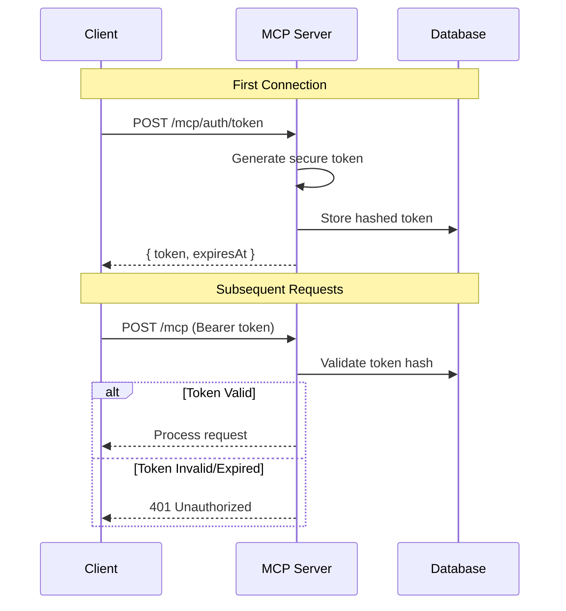

# MCP Security Framework Specification

**Version:** 1.0.0
**Date:** 2026-01-13
**Status:** Draft
**Author:** AI-assisted via @loops/authoring/spec-drafting
**Depends on:** [01-mcp-server.md](./01-mcp-server.md), [02-mcp-client.md](./02-mcp-client.md)
**Source:** `docs/mcp-integration-spec.md`

---

## Table of Contents

1. [Problem Statement](#1-problem-statement)
2. [Threat Model](#2-threat-model)
3. [Security Architecture](#3-security-architecture)
4. [Security Requirements](#4-security-requirements)
5. [Implementation Guidelines](#5-implementation-guidelines)
6. [Acceptance Criteria](#6-acceptance-criteria)

---

## 1. Problem Statement

MCP integration introduces new attack surfaces:

1. **Server Mode**: External agents gain programmatic control of notebooks
2. **Client Mode**: Notebooks execute code from external MCP servers

This specification defines security controls to mitigate risks while maintaining usability.

### Security Goals

| ID | Goal | Priority | Rationale |
|----|------|----------|-----------|
| SG-001 | Prevent unauthorized notebook access | Must | Protect user data |
| SG-002 | Prevent malicious code execution | Must | System integrity |
| SG-003 | Enable human oversight | Must | Maintain control |
| SG-004 | Audit all MCP operations | Should | Accountability |
| SG-005 | Limit blast radius of compromise | Should | Defense in depth |

### Out of Scope

- Multi-user authentication (single-user deployment assumed)
- Enterprise SSO integration
- Network-level security (handled by deployment)

---

## 2. Threat Model

### 2.1 Threat Actors

| Actor | Capability | Motivation |
|-------|------------|------------|
| Malicious Agent | Full MCP protocol access | Data theft, system compromise |
| Compromised MCP Server | Arbitrary tool implementations | Lateral movement, data exfiltration |
| Malicious Notebook | Code execution within Srcbook | Resource abuse, data access |
| Network Attacker | Traffic interception | Credential theft, MITM |

### 2.2 Attack Vectors

#### MCP Server Mode (Srcbook Exposed)

| Vector | Description | Severity | Likelihood |
|--------|-------------|----------|------------|
| Unauthorized Access | Agent connects without permission | High | Medium |
| Injection Attacks | Malicious input to tools | High | Medium |
| Resource Exhaustion | Overwhelming tool invocations | Medium | High |
| Data Exfiltration | Reading sensitive notebook content | High | Low |
| Denial of Service | Crashing server with malformed requests | Medium | Medium |

#### MCP Client Mode (Consuming External)

| Vector | Description | Severity | Likelihood |
|--------|-------------|----------|------------|
| Malicious Tool Response | Server returns harmful content | High | Low |
| Command Injection | Server config leads to arbitrary execution | Critical | Low |
| SSRF | Server tricks client into internal requests | High | Low |
| Data Leakage | Sensitive data sent to untrusted server | High | Medium |
| Supply Chain | Compromised MCP server package | Critical | Low |

### 2.3 Trust Boundaries

```
┌─────────────────────────────────────────────────────────────────┐
│                        TRUSTED ZONE                              │
│  ┌─────────────┐     ┌─────────────┐     ┌─────────────┐       │
│  │   Srcbook   │◄───►│   MCP       │◄───►│   Core      │       │
│  │   UI        │     │   Bridge    │     │   Engine    │       │
│  └─────────────┘     └─────────────┘     └─────────────┘       │
│                             │                                    │
│                             │ TRUST BOUNDARY                     │
│ ════════════════════════════╪════════════════════════════════════│
│                             │                                    │
│                             ▼                                    │
│  ┌─────────────────────────────────────────────────────────┐   │
│  │                   UNTRUSTED ZONE                         │   │
│  │  ┌─────────────┐               ┌─────────────┐          │   │
│  │  │  External   │               │  External   │          │   │
│  │  │  MCP        │               │  MCP        │          │   │
│  │  │  Clients    │               │  Servers    │          │   │
│  │  └─────────────┘               └─────────────┘          │   │
│  └─────────────────────────────────────────────────────────┘   │
└─────────────────────────────────────────────────────────────────┘
```

---

## 3. Security Architecture

### 3.1 Defense Layers

```
Layer 1: Transport Security
  ├── TLS for HTTP transport
  ├── Process isolation for stdio
  └── Origin validation

Layer 2: Authentication & Authorization
  ├── Client identification
  ├── Operation allowlisting
  └── Human approval gates

Layer 3: Input Validation
  ├── Schema validation for tool inputs
  ├── URI validation for resources
  └── Content sanitization

Layer 4: Execution Isolation
  ├── Sandboxed tool execution
  ├── Resource limits
  └── Timeout enforcement

Layer 5: Monitoring & Audit
  ├── Operation logging
  ├── Anomaly detection
  └── Rate limiting
```

### 3.2 Security Components

```typescript
// Security middleware stack

interface SecurityMiddleware {
  // Called before processing MCP message
  beforeMessage(msg: MCPMessage): Promise<SecurityDecision>;

  // Called after getting tool result
  afterToolResult(result: ToolResult): Promise<ToolResult>;

  // Called on security event
  onSecurityEvent(event: SecurityEvent): Promise<void>;
}

interface SecurityDecision {
  allow: boolean;
  reason?: string;
  requireApproval?: boolean;
  modifiedInput?: unknown;
}
```

---

## 4. Security Requirements

### 4.1 Transport Security

| ID | Requirement | Priority | Acceptance Criteria |
|----|-------------|----------|---------------------|
| SEC-TS-001 | HTTP transport uses TLS in production | Must | HTTPS enforced for remote connections |
| SEC-TS-002 | stdio processes isolated | Must | Separate process per server |
| SEC-TS-003 | Origin header validated | Must | Reject non-allowlisted origins |
| SEC-TS-004 | No sensitive data in URLs | Must | Parameters in body, not query string |
| SEC-TS-005 | Certificate verification | Should | Validate TLS certificates |

### 4.2 Authentication & Authorization

| ID | Requirement | Priority | Acceptance Criteria |
|----|-------------|----------|---------------------|
| SEC-AA-001 | MCP clients identified | Must | Unique client ID per session |
| SEC-AA-002 | Operation allowlist | Must | Only configured operations allowed |
| SEC-AA-003 | Sensitive operations require approval | Must | Delete, export prompt user |
| SEC-AA-004 | Session timeout | Must | Inactive sessions expire |
| SEC-AA-005 | Rate limiting per client | Must | Prevent resource exhaustion |
| SEC-AA-006 | HTTP transport requires Bearer token | Must | Token validated on every request |
| SEC-AA-007 | stdio transport implicitly trusted | Must | Local processes authenticated by spawn |
| SEC-AA-008 | Token generation on first connection | Must | Cryptographically secure token created |
| SEC-AA-009 | Token stored securely in database | Must | Token hashed before storage |
| SEC-AA-010 | Token expiry configurable | Should | Default 24h, configurable 1h-7d |

#### 4.2.1 Authentication Mechanism (GAP-001 Resolution)

**HTTP Transport Authentication:**

The MCP HTTP transport uses Bearer token authentication:

```
Authorization: Bearer <mcp_token>
```

**Token Lifecycle:**



**Token Schema:**

```typescript
interface MCPToken {
  id: string;              // UUID
  tokenHash: string;       // SHA-256 hash of actual token
  clientName: string;      // Human-readable client identifier
  createdAt: Date;
  expiresAt: Date;
  lastUsedAt: Date;
  permissions: string[];   // Allowed operations (empty = all)
  revokedAt?: Date;
}
```

**Database Table:**

```sql
CREATE TABLE mcp_tokens (
  id TEXT PRIMARY KEY,
  token_hash TEXT NOT NULL UNIQUE,
  client_name TEXT NOT NULL,
  permissions JSON NOT NULL DEFAULT '[]',
  created_at TIMESTAMP DEFAULT CURRENT_TIMESTAMP,
  expires_at TIMESTAMP NOT NULL,
  last_used_at TIMESTAMP,
  revoked_at TIMESTAMP
);

CREATE INDEX idx_mcp_tokens_hash ON mcp_tokens(token_hash);
CREATE INDEX idx_mcp_tokens_expires ON mcp_tokens(expires_at);
```

**Token Generation:**

```typescript
import crypto from 'crypto';

function generateMCPToken(): { token: string; hash: string } {
  // 32 bytes = 256 bits of entropy
  const token = crypto.randomBytes(32).toString('base64url');
  const hash = crypto.createHash('sha256').update(token).digest('hex');
  return { token, hash };
}
```

**stdio Transport Authentication:**

For stdio transport, authentication is implicit:

1. Srcbook spawns the MCP server process
2. The process inherits trust from the spawn operation
3. No additional authentication required
4. Communication is via stdin/stdout (not network-accessible)

**Transport-Specific Origin Validation:**

| Transport | Origin Validation | Authentication |
|-----------|-------------------|----------------|
| HTTP | Required (allowlist) | Bearer token |
| stdio | N/A (local process) | Implicit (spawned by Srcbook) |

**API Endpoints for Token Management:**

```
POST   /mcp/auth/token          # Generate new token
GET    /mcp/auth/tokens         # List active tokens
DELETE /mcp/auth/token/:id      # Revoke token
POST   /mcp/auth/token/:id/refresh  # Extend expiry
```

### 4.3 Input Validation

| ID | Requirement | Priority | Acceptance Criteria |
|----|-------------|----------|---------------------|
| SEC-IV-001 | Tool inputs validated against schema | Must | Invalid inputs rejected |
| SEC-IV-002 | Resource URIs validated | Must | Only expected schemes allowed |
| SEC-IV-003 | String inputs sanitized | Must | Path traversal prevented |
| SEC-IV-004 | Size limits enforced | Must | Large inputs rejected |
| SEC-IV-005 | Content type validation | Should | Unexpected content rejected |

### 4.4 Execution Isolation

| ID | Requirement | Priority | Acceptance Criteria |
|----|-------------|----------|---------------------|
| SEC-EI-001 | Tool execution timeout | Must | Long-running tools terminated |
| SEC-EI-002 | Memory limits | Should | Tools cannot exhaust memory |
| SEC-EI-003 | Network isolation | Could | Tools cannot make arbitrary requests |
| SEC-EI-004 | File system isolation | Should | Tools cannot access arbitrary paths |
| SEC-EI-005 | External server sandboxing | Must | stdio processes restricted |

### 4.5 Data Protection

| ID | Requirement | Priority | Acceptance Criteria |
|----|-------------|----------|---------------------|
| SEC-DP-001 | Session isolation | Must | Data not leaked between sessions |
| SEC-DP-002 | Sensitive data not logged | Must | Passwords, keys redacted |
| SEC-DP-003 | Secure session IDs | Must | Cryptographically random |
| SEC-DP-004 | Resource content filtered | Should | Sensitive patterns detected |
| SEC-DP-005 | Tool results sanitized | Should | Dangerous content flagged |

### 4.6 Server Trust (Client Mode)

| ID | Requirement | Priority | Acceptance Criteria |
|----|-------------|----------|---------------------|
| SEC-ST-001 | Server allowlist | Must | Only approved servers connectable |
| SEC-ST-002 | Command injection prevention | Must | Server config sanitized |
| SEC-ST-003 | Environment variable filtering | Must | Only allowlisted env vars passed |
| SEC-ST-004 | Tool invocation logging | Must | All calls to external servers logged |
| SEC-ST-005 | Result size limits | Must | Large results truncated |

### 4.7 Audit & Monitoring

| ID | Requirement | Priority | Acceptance Criteria |
|----|-------------|----------|---------------------|
| SEC-AM-001 | All MCP operations logged | Must | Logs include timestamp, client, operation |
| SEC-AM-002 | Security events alerted | Should | Suspicious activity flagged |
| SEC-AM-003 | Audit log integrity | Should | Logs tamper-evident |
| SEC-AM-004 | Log retention | Should | 30-day minimum retention |
| SEC-AM-005 | Failed operation logging | Must | All failures logged with context |

---

## 5. Implementation Guidelines

### 5.1 Human-in-the-Loop Controls

Operations requiring user approval:

| Operation | Approval Type | Message |
|-----------|---------------|---------|
| `notebook_delete` | Confirm | "Delete notebook '{title}'?" |
| `notebook_export` | Confirm | "Export notebook to external agent?" |
| First connection | Confirm | "Allow agent to control notebooks?" |
| External server install | Confirm | "Install MCP server '{name}'?" |

Implementation:

```typescript
interface ApprovalRequest {
  operation: string;
  description: string;
  clientId: string;
  details: Record<string, unknown>;
  timeout: number;  // Auto-deny after timeout
}

interface ApprovalResponse {
  approved: boolean;
  rememberedFor?: 'session' | 'always' | 'never';
}

async function requireApproval(request: ApprovalRequest): Promise<ApprovalResponse> {
  // Check if approval remembered
  const remembered = await checkRememberedApproval(request.operation, request.clientId);
  if (remembered !== null) {
    return { approved: remembered };
  }

  // Show UI prompt
  return await showApprovalDialog(request);
}
```

### 5.2 Rate Limiting

```typescript
interface RateLimitConfig {
  windowMs: number;      // Time window
  maxRequests: number;   // Max requests per window
  message: string;       // Error message when exceeded
}

const rateLimits: Record<string, RateLimitConfig> = {
  'tool:invoke': {
    windowMs: 60000,
    maxRequests: 100,
    message: 'Tool invocation rate limit exceeded'
  },
  'resource:read': {
    windowMs: 60000,
    maxRequests: 200,
    message: 'Resource read rate limit exceeded'
  },
  'notebook:create': {
    windowMs: 60000,
    maxRequests: 10,
    message: 'Notebook creation rate limit exceeded'
  }
};
```

### 5.3 Input Validation

```typescript
// Tool input validation
async function validateToolInput(tool: Tool, input: unknown): Promise<ValidationResult> {
  // 1. Schema validation
  const schemaResult = await validateSchema(tool.inputSchema, input);
  if (!schemaResult.valid) {
    return { valid: false, errors: schemaResult.errors };
  }

  // 2. Security-specific validation
  const securityResult = await validateSecurity(tool, input);
  if (!securityResult.valid) {
    return { valid: false, errors: securityResult.errors };
  }

  // 3. Size limits
  const size = JSON.stringify(input).length;
  if (size > MAX_INPUT_SIZE) {
    return { valid: false, errors: ['Input too large'] };
  }

  return { valid: true };
}

// Security-specific validations
function validateSecurity(tool: Tool, input: unknown): ValidationResult {
  const errors: string[] = [];

  // Check for path traversal
  walkObject(input, (key, value) => {
    if (typeof value === 'string') {
      if (value.includes('../') || value.includes('..\\')) {
        errors.push(`Path traversal detected in ${key}`);
      }
    }
  });

  // Check for command injection in string fields
  walkObject(input, (key, value) => {
    if (typeof value === 'string') {
      if (containsCommandInjection(value)) {
        errors.push(`Potential command injection in ${key}`);
      }
    }
  });

  return { valid: errors.length === 0, errors };
}
```

### 5.4 Session Management

```typescript
interface MCPSession {
  id: string;
  clientId: string;
  createdAt: Date;
  lastActivityAt: Date;
  expiresAt: Date;
  permissions: Set<string>;
  approvals: Map<string, 'session' | 'always'>;
}

const SESSION_TIMEOUT = 30 * 60 * 1000;  // 30 minutes
const MAX_SESSIONS = 10;

async function createSession(clientId: string): Promise<MCPSession> {
  // Cleanup expired sessions
  await cleanupExpiredSessions();

  // Check session limit
  const activeSessions = await countActiveSessions();
  if (activeSessions >= MAX_SESSIONS) {
    throw new Error('Maximum concurrent sessions reached');
  }

  // Create new session
  return {
    id: crypto.randomUUID(),
    clientId,
    createdAt: new Date(),
    lastActivityAt: new Date(),
    expiresAt: new Date(Date.now() + SESSION_TIMEOUT),
    permissions: new Set(),
    approvals: new Map()
  };
}
```

### 5.5 Server Allowlist (Client Mode)

```typescript
interface ServerAllowlistEntry {
  name: string;
  command?: string;     // For stdio: exact command
  commandPattern?: RegExp;  // For stdio: pattern
  url?: string;         // For HTTP: exact URL
  urlPattern?: RegExp;  // For HTTP: pattern
  allowedEnv: string[]; // Environment variables to pass
}

const defaultAllowlist: ServerAllowlistEntry[] = [
  {
    name: 'PostgreSQL',
    command: 'npx',
    commandPattern: /^-y\s+@modelcontextprotocol\/server-postgres$/,
    allowedEnv: ['DATABASE_URL', 'PGHOST', 'PGPORT', 'PGUSER', 'PGPASSWORD', 'PGDATABASE']
  },
  {
    name: 'Filesystem',
    command: 'npx',
    commandPattern: /^-y\s+@modelcontextprotocol\/server-filesystem\s+.*$/,
    allowedEnv: []
  }
];

function validateServerConfig(config: MCPServerConfig): ValidationResult {
  // Check if server matches allowlist
  const match = allowlist.find(entry => matchesEntry(config, entry));
  if (!match) {
    return {
      valid: false,
      requiresApproval: true,
      message: 'Server not in allowlist. User approval required.'
    };
  }

  // Filter environment variables
  const filteredEnv: Record<string, string> = {};
  for (const key of match.allowedEnv) {
    if (config.env?.[key]) {
      filteredEnv[key] = config.env[key];
    }
  }
  config.env = filteredEnv;

  return { valid: true };
}
```

### 5.6 Audit Logging

```typescript
interface AuditLogEntry {
  id: string;
  timestamp: Date;
  level: 'info' | 'warn' | 'error' | 'security';
  category: 'mcp_server' | 'mcp_client' | 'authentication' | 'authorization';
  operation: string;
  clientId?: string;
  sessionId?: string;
  serverId?: string;
  input?: unknown;   // Redacted
  output?: unknown;  // Redacted
  error?: string;
  duration?: number;
  metadata: Record<string, unknown>;
}

// Redaction patterns
const REDACTION_PATTERNS = [
  /password/i,
  /secret/i,
  /token/i,
  /api[_-]?key/i,
  /auth/i,
  /bearer/i
];

function redactSensitive(obj: unknown): unknown {
  if (typeof obj !== 'object' || obj === null) {
    return obj;
  }

  const redacted: Record<string, unknown> = {};
  for (const [key, value] of Object.entries(obj)) {
    if (REDACTION_PATTERNS.some(p => p.test(key))) {
      redacted[key] = '[REDACTED]';
    } else if (typeof value === 'object') {
      redacted[key] = redactSensitive(value);
    } else {
      redacted[key] = value;
    }
  }
  return redacted;
}
```

---

## 6. Acceptance Criteria

### 6.1 Security Tests

| Test | Expected Result |
|------|-----------------|
| Connect without Origin header | Rejected with 403 |
| Tool input with path traversal | Rejected with validation error |
| Exceed rate limit | Request blocked, 429 returned |
| Delete notebook without approval | Prompt shown to user |
| Add untrusted server | Approval dialog shown |
| Session timeout | Operations fail after timeout |

### 6.2 Penetration Testing Checklist

- [ ] SQL injection in tool inputs
- [ ] Command injection in server config
- [ ] Path traversal in resource URIs
- [ ] XSS in tool results
- [ ] SSRF via resource URIs
- [ ] Session fixation
- [ ] Rate limit bypass
- [ ] Authentication bypass

### 6.3 Compliance Verification

| Control | Verification Method |
|---------|---------------------|
| Audit logging | Check log completeness |
| Data redaction | Search logs for sensitive patterns |
| Rate limiting | Load test with burst traffic |
| Input validation | Fuzzing test suite |
| Session management | Timeout verification |

---

**Cross-References:**
- [00-mcp-foundation.md](./00-mcp-foundation.md) - Architecture overview
- [01-mcp-server.md](./01-mcp-server.md) - Server implementation
- [02-mcp-client.md](./02-mcp-client.md) - Client implementation
- [04-mcp-testing.md](./04-mcp-testing.md) - Testing strategy

**Source Material:**
- `docs/mcp-integration-spec.md` - Security considerations section
- OWASP Top 10
- MCP Security Best Practices
