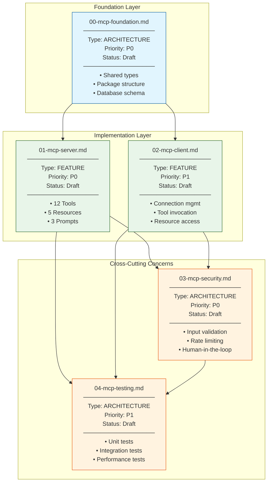
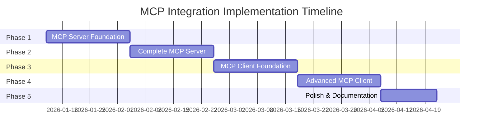

# MCP Integration Specification Dependency Graph

**Generated:** 2026-01-13
**Spec Count:** 5 specifications

---

## Visual Dependency Graph



## Implementation Phases



## Dependency Matrix

| Spec | Depends On | Required By |
|------|------------|-------------|
| 00-mcp-foundation | None | 01, 02, 03, 04 |
| 01-mcp-server | 00 | 03, 04 |
| 02-mcp-client | 00 | 03, 04 |
| 03-mcp-security | 01, 02 | 04 |
| 04-mcp-testing | 01, 02, 03 | None |

## Critical Path

The critical path for implementation is:

```
00-mcp-foundation → 01-mcp-server → 03-mcp-security → 04-mcp-testing
```

**Estimated Duration:** 14 weeks

## Parallelization Opportunities

The following specs can be worked on in parallel:

1. **After 00-mcp-foundation completes:**
   - 01-mcp-server (Team A)
   - 02-mcp-client (Team B)

2. **After 01 and 02 complete:**
   - 03-mcp-security (full attention required)

3. **Throughout:**
   - 04-mcp-testing can begin unit test scaffolding early

## Spec Summary Table

| ID | Name | Type | Priority | Lines | Requirements |
|----|------|------|----------|-------|--------------|
| 00 | MCP Foundation | ARCH | P0 | ~400 | FR: 5, NFR: 4 |
| 01 | MCP Server | FEAT | P0 | ~550 | FR: 27, NFR: 11 |
| 02 | MCP Client | FEAT | P1 | ~500 | FR: 25, NFR: 8 |
| 03 | MCP Security | ARCH | P0 | ~350 | SEC: 32 |
| 04 | MCP Testing | ARCH | P1 | ~500 | Test cases: 50+ |

---

## Reading Order

For implementers, the recommended reading order is:

1. **Start here:** [inventory.md](./inventory.md) - Overview and mapping
2. **Architecture:** [00-mcp-foundation.md](./00-mcp-foundation.md) - Core concepts
3. **Server side:** [01-mcp-server.md](./01-mcp-server.md) - Tool/resource details
4. **Client side:** [02-mcp-client.md](./02-mcp-client.md) - Connection and invocation
5. **Security:** [03-mcp-security.md](./03-mcp-security.md) - Security requirements
6. **Testing:** [04-mcp-testing.md](./04-mcp-testing.md) - Test strategy

---

*Generated by /spec-designer workflow*
