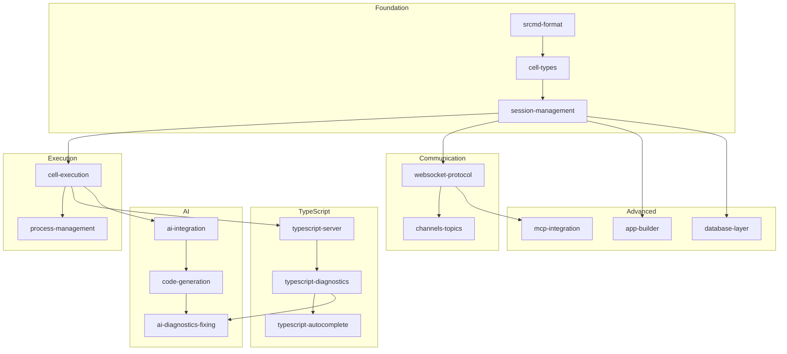

# Educational Srcbooks Implementation Inventory

**Version:** 1.0
**Date:** 2026-01-14
**Status:** Implementation-Ready
**Parent Spec:** `docs/educational-srcbooks-spec.md`

---

## Overview

This inventory tracks the implementation status of all 16 educational Srcbooks that explain Srcbook's internal architecture.

## Dependency Graph



## Implementation Status

| # | Srcbook | File | Status | Spec |
|---|---------|------|--------|------|
| 1 | Srcmd Format | `srcmd-format.src.md` | ✅ Complete | - |
| 2 | Cell Types | `cell-types.src.md` | ✅ Complete | - |
| 3 | Session Management | `session-management.src.md` | ✅ Complete | - |
| 4 | Cell Execution | `cell-execution.src.md` | 📋 Spec Ready | `01-cell-execution.md` |
| 5 | Process Management | `process-management.src.md` | 📋 Spec Ready | `02-process-management.md` |
| 6 | WebSocket Protocol | `websocket-protocol.src.md` | 📋 Spec Ready | `03-websocket-protocol.md` |
| 7 | Channels & Topics | `channels-topics.src.md` | 📋 Spec Ready | `04-channels-topics.md` |
| 8 | TypeScript Server | `typescript-server.src.md` | 📋 Spec Ready | `05-typescript-server.md` |
| 9 | Diagnostics | `typescript-diagnostics.src.md` | 📋 Spec Ready | `06-typescript-diagnostics.md` |
| 10 | Autocomplete | `typescript-autocomplete.src.md` | 📋 Spec Ready | `07-typescript-autocomplete.md` |
| 11 | AI Integration | `ai-integration.src.md` | 📋 Spec Ready | `08-ai-integration.md` |
| 12 | Code Generation | `code-generation.src.md` | 📋 Spec Ready | `09-code-generation.md` |
| 13 | AI Diagnostics Fix | `ai-diagnostics-fixing.src.md` | 📋 Spec Ready | `10-ai-diagnostics-fixing.md` |
| 14 | App Builder | `app-builder.src.md` | 📋 Spec Ready | `11-app-builder.md` |
| 15 | Database Layer | `database-layer.src.md` | 📋 Spec Ready | `12-database-layer.md` |
| 16 | MCP Integration | `mcp-integration.src.md` | 📋 Spec Ready | `13-mcp-integration.md` |

## Output Location

All Srcbooks should be created in:
```
packages/api/srcbook/examples/internals/
```

## Implementation Order

### Phase 2: Execution Layer
1. `01-cell-execution.md` → `cell-execution.src.md`
2. `02-process-management.md` → `process-management.src.md`

### Phase 3: Communication Layer
3. `03-websocket-protocol.md` → `websocket-protocol.src.md`
4. `04-channels-topics.md` → `channels-topics.src.md`

### Phase 4: TypeScript Layer
5. `05-typescript-server.md` → `typescript-server.src.md`
6. `06-typescript-diagnostics.md` → `typescript-diagnostics.src.md`
7. `07-typescript-autocomplete.md` → `typescript-autocomplete.src.md`

### Phase 5: AI Layer
8. `08-ai-integration.md` → `ai-integration.src.md`
9. `09-code-generation.md` → `code-generation.src.md`
10. `10-ai-diagnostics-fixing.md` → `ai-diagnostics-fixing.src.md`

### Phase 6: Advanced Layer
11. `11-app-builder.md` → `app-builder.src.md`
12. `12-database-layer.md` → `database-layer.src.md`
13. `13-mcp-integration.md` → `mcp-integration.src.md`

## Quality Checklist (Per Srcbook)

- [ ] All code cells execute successfully
- [ ] Source references are accurate and linked
- [ ] Cross-references to related Srcbooks work
- [ ] Learning objectives are measurable
- [ ] Interactive exercises are achievable
- [ ] ASCII diagrams render correctly

---

## Spec Summary

All 13 implementation specifications have been created:

| Phase | Specs | Coverage |
|-------|-------|----------|
| Execution | 01-02 | Cell execution, process registry |
| Communication | 03-04 | WebSocket protocol, channels/topics |
| TypeScript | 05-07 | tsserver, diagnostics, autocomplete |
| AI | 08-10 | Provider integration, code gen, error fixing |
| Advanced | 11-13 | App builder, database, MCP |

Each spec includes:
- Learning objectives
- Architecture diagrams
- Simple and advanced code demos
- Deep dive implementation details
- Interactive exercises
- Source file references

---

**Next Action:** Use `/workflows:spec-orchestrator` to implement Srcbooks from these specs
