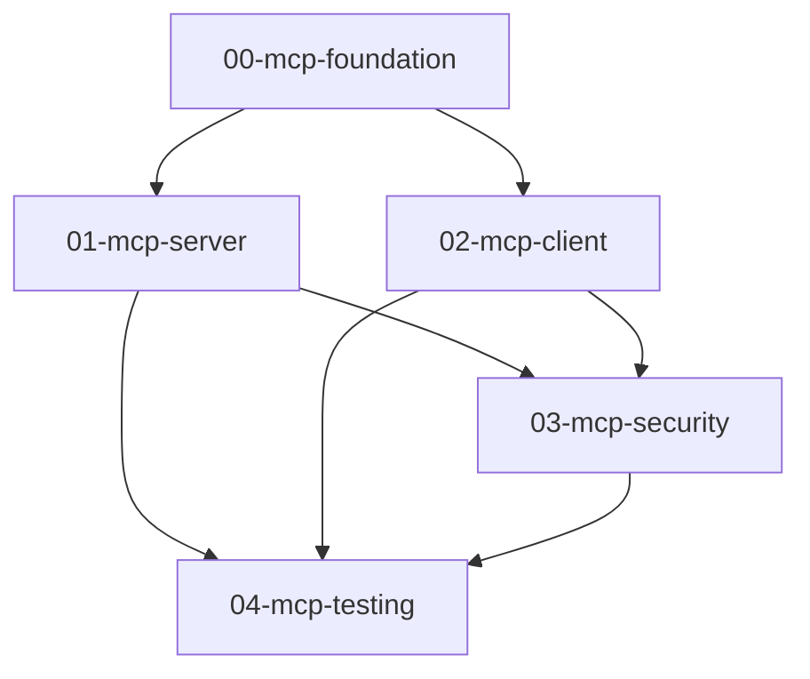

# MCP Integration Specification Inventory

**Version:** 1.0.0
**Date:** 2026-01-13
**Status:** Draft
**Source:** Converted from `docs/` folder content
**Author:** AI-assisted via @loops/authoring/spec-drafting

---

## Overview

This inventory catalogs the specifications derived from the Srcbook MCP Integration documentation. The original docs/ folder contained a comprehensive design for bidirectional MCP integration—these specs decompose that design into implementation-ready units.

## Spec Dependencies

## Specification List

| ID | Name | Type | Priority | Status | Dependencies |
|----|------|------|----------|--------|--------------|
| 00 | MCP Foundation | ARCHITECTURE | P0 | Draft | None |
| 01 | MCP Server Implementation | FEATURE | P0 | Draft | 00 |
| 02 | MCP Client Implementation | FEATURE | P1 | Draft | 00 |
| 03 | MCP Security Framework | ARCHITECTURE | P0 | Draft | 01, 02 |
| 04 | MCP Testing Strategy | ARCHITECTURE | P1 | Draft | 01, 02, 03 |

## Spec Summaries

### 00-mcp-foundation.md
**Type:** ARCHITECTURE
**Purpose:** Define shared concepts, data types, and infrastructure for MCP integration
**Key Sections:**
- Protocol version (2025-11-25)
- Dual-role architecture overview
- Shared TypeScript interfaces
- Package structure
- Database schema extensions

### 01-mcp-server.md
**Type:** FEATURE
**Purpose:** Srcbook as MCP Provider—expose notebook operations to external agents
**Key Sections:**
- 12 Tools specification (notebook CRUD, cell operations, execution)
- 5 Resource types specification
- 3 Prompt templates
- Transport configuration (HTTP, stdio)
- Integration with core notebook engine

### 02-mcp-client.md
**Type:** FEATURE
**Purpose:** Srcbook as MCP Consumer—leverage external MCP servers
**Key Sections:**
- Server connection management
- Tool discovery and invocation
- Resource consumption
- Sampling integration
- UI components for server management

### 03-mcp-security.md
**Type:** ARCHITECTURE
**Purpose:** Security framework for bidirectional MCP integration
**Key Sections:**
- Human-in-the-loop controls
- Input validation requirements
- Rate limiting and quotas
- Session management and isolation
- Server allowlisting

### 04-mcp-testing.md
**Type:** ARCHITECTURE
**Purpose:** Testing strategy for MCP integration
**Key Sections:**
- Unit test requirements
- Integration test scenarios
- Agent workflow tests
- Performance benchmarks
- Success metrics

## Implementation Phases

The specs map to implementation phases:

| Phase | Weeks | Specs Covered |
|-------|-------|---------------|
| 1: MCP Server Foundation | 1-3 | 00, 01 (partial) |
| 2: Complete MCP Server | 4-6 | 01 (complete), 03 (partial) |
| 3: MCP Client Foundation | 7-9 | 02 (partial) |
| 4: Advanced MCP Client | 10-12 | 02 (complete), 03 (complete) |
| 5: Polish & Documentation | 13-14 | 04 |

## Source Material Mapping

| Source Doc | Target Spec(s) |
|------------|----------------|
| README-MCP.md | 00-mcp-foundation.md (overview) |
| mcp-integration-spec.md | All specs (primary source) |
| mcp-quick-reference.md | 01, 02 (API reference sections) |
| mcp-example-notebook.src.md | 02, 04 (usage examples, test cases) |

## Quality Metrics

| Metric | Target | Current |
|--------|--------|---------|
| Requirement coverage | 100% | TBD |
| Cross-reference validity | 100% | TBD |
| TBD resolution | <5% | TBD |
| Acceptance criteria per requirement | ≥1 | TBD |

---

**Next Steps:**
1. Review individual specs
2. Validate cross-references
3. Resolve TBD items
4. Proceed to implementation via `/spec-orchestrator .specs/`
