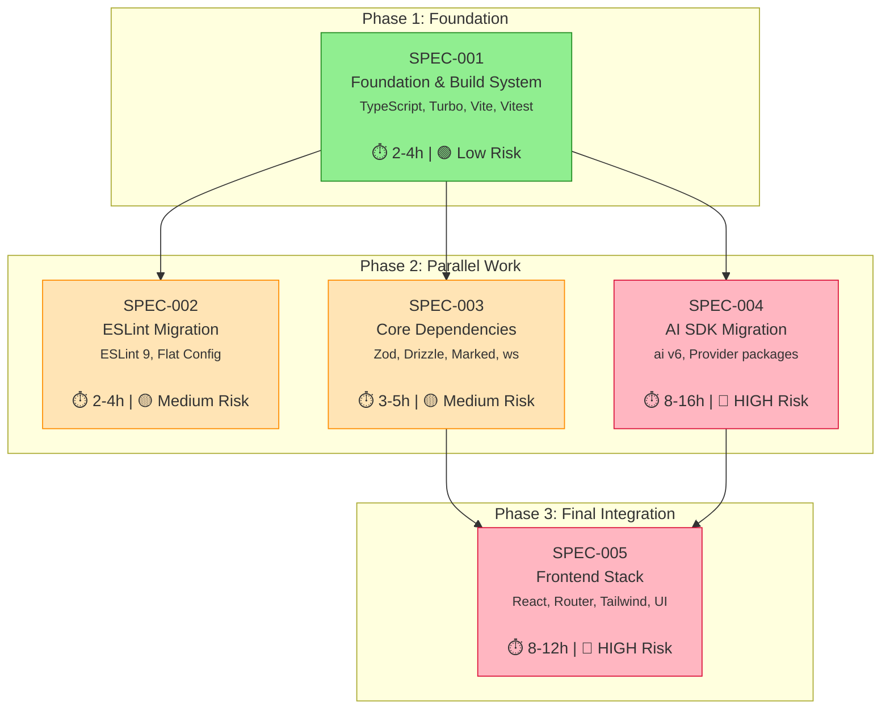
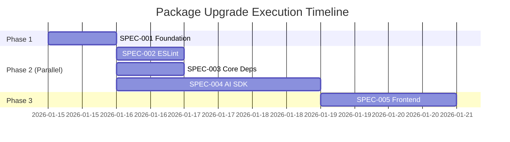
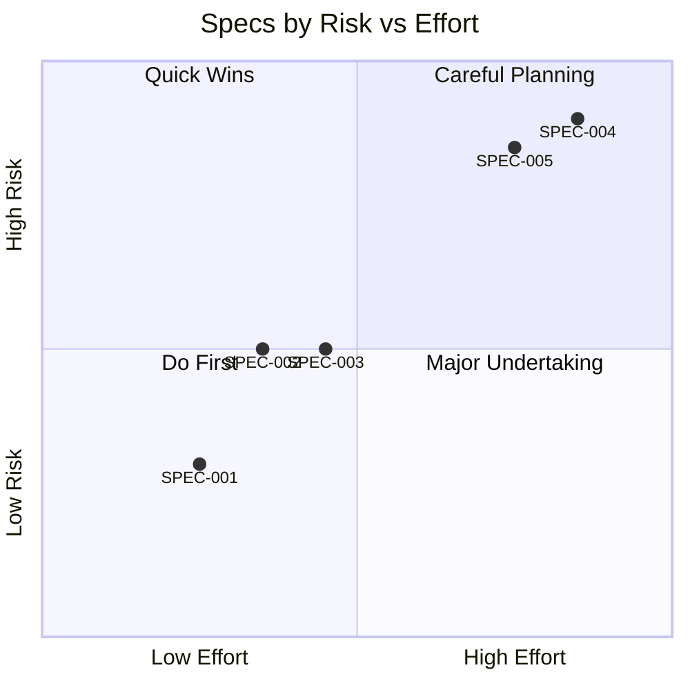

# Package Upgrade Dependency Graph

## Overview

This document visualizes the dependencies between package upgrade specifications.

## Dependency Graph



## Execution Timeline



## Critical Path

The critical path (longest path) is:

```
SPEC-001 → SPEC-004 → SPEC-005
```

**Critical Path Duration:** 18-32 hours

This is determined by:
1. SPEC-001 must complete first (2-4h)
2. SPEC-004 (AI SDK) is the longest task (8-16h)
3. SPEC-005 depends on both SPEC-003 and SPEC-004

## Parallelization Opportunities

After SPEC-001 completes, these specs can run in parallel:

| Spec | Can Run With | Reason |
|------|--------------|--------|
| SPEC-002 | SPEC-003, SPEC-004 | No shared files |
| SPEC-003 | SPEC-002, SPEC-004 | Different packages |
| SPEC-004 | SPEC-002, SPEC-003 | Different packages |

## Risk Assessment



## Dependency Matrix

| Spec | Depends On | Blocks |
|------|------------|--------|
| SPEC-001 | - | SPEC-002, 003, 004 |
| SPEC-002 | SPEC-001 | - |
| SPEC-003 | SPEC-001 | SPEC-005 |
| SPEC-004 | SPEC-001 | SPEC-005 |
| SPEC-005 | SPEC-003, SPEC-004 | - |

## Impact Analysis

### If SPEC-001 Fails
- **Impact:** All other specs blocked
- **Mitigation:** Low risk, well-understood changes

### If SPEC-004 Fails
- **Impact:** SPEC-005 blocked, AI features broken
- **Mitigation:** Keep backup, extensive testing, rollback plan

### If SPEC-005 Fails (React 19 path)
- **Impact:** UI broken
- **Mitigation:** Fallback to React 18, defer Tailwind 4

## Recommended Execution Order

1. **Day 1**: SPEC-001 (Foundation)
2. **Day 2-3**: SPEC-002, SPEC-003, SPEC-004 in parallel
   - Assign different developers if available
   - SPEC-004 will take longest
3. **Day 4-5**: SPEC-005 (Frontend)
4. **Day 6**: Integration testing, bug fixes

## Notes

- SPEC-002 is independent after SPEC-001 and can be done by a different team member
- SPEC-004 is on the critical path and has highest risk—should start as soon as SPEC-001 completes
- Consider doing SPEC-005 in two parts: stable updates first, then React 19/Tailwind 4 decisions
