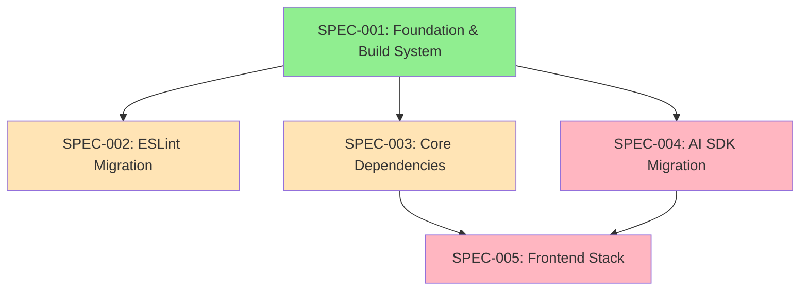

# Package Upgrade Specification Inventory

**Version:** 1.0.0
**Date:** 2026-01-14
**Status:** Ready for Implementation
**Author:** AI-assisted via /spec-designer

---

## Overview

This inventory catalogs specifications for upgrading all packages in the srcbook monorepo to their latest versions. The project hasn't been updated in approximately one year, resulting in 12+ major version jumps across critical dependencies.

## Spec Dependencies



Legend: Green = Low Risk, Orange = Medium Risk, Pink = High Risk

## Specification List

| ID | Name | Priority | Risk | Effort | Dependencies |
|----|------|----------|------|--------|--------------|
| SPEC-001 | Foundation & Build System | P0 | Low-Med | 2-4h | None |
| SPEC-002 | ESLint Flat Config Migration | P1 | Medium | 2-4h | 001 |
| SPEC-003 | Core Dependencies Upgrade | P1 | Medium | 3-5h | 001 |
| SPEC-004 | AI SDK v6 Migration | P0 | HIGH | 8-16h | 001 |
| SPEC-005 | Frontend Stack Upgrade | P2 | HIGH | 8-12h | 003, 004 |

**Total Estimated Effort: 23-41 hours**

## Execution Order

### Phase 1: Foundation (Required First)
- **SPEC-001**: Foundation & Build System
  - TypeScript, Turbo, Vite, Vitest upgrades
  - Must complete before all other specs

### Phase 2: Parallel Work
After SPEC-001, these can execute concurrently:
- **SPEC-002**: ESLint 9 flat config migration
- **SPEC-003**: Zod, Drizzle, utility library upgrades
- **SPEC-004**: Vercel AI SDK v3→v6 migration

### Phase 3: Final Integration
- **SPEC-005**: React, Router, Tailwind, UI component upgrades
  - Depends on SPEC-003 (Zod types) and SPEC-004 (AI SDK)

## Spec Summaries

### SPEC-001-foundation-build-system.md
**Priority:** P0 | **Risk:** Low-Medium | **Effort:** 2-4h

Updates:
- TypeScript 5.6.2 → 5.9.x
- Turbo 2.1.1 → 2.7.x
- Vite 5.4.4 → 7.x
- Vitest 2.0.5 → 4.x
- vite-node, @vitejs/plugin-react-swc

**Why First:** Build system must function before other changes.

---

### SPEC-002-eslint-flat-config-migration.md
**Priority:** P1 | **Risk:** Medium | **Effort:** 2-4h

Updates:
- ESLint 8.57.0 → 9.x
- .eslintrc → eslint.config.js flat config
- @typescript-eslint/* to v8

**Breaking Changes:**
- New configuration format (eslintrc → flat config)
- Plugin API changes

---

### SPEC-003-core-dependencies-upgrade.md
**Priority:** P1 | **Risk:** Medium | **Effort:** 3-5h

Updates:
- Zod 3.23.8 → 4.3.5
- drizzle-orm 0.33.0 → 0.45.x
- drizzle-kit 0.24.2 → 0.31.x
- better-sqlite3 11.3.0 → 12.x
- marked 14.1.2 → 17.x
- ws 8.17.0 → 8.19.x

**Breaking Changes:**
- Zod 4 API changes (mostly improvements)
- Drizzle migration folder structure

---

### SPEC-004-ai-sdk-migration.md
**Priority:** P0 | **Risk:** HIGH | **Effort:** 8-16h

Updates:
- ai 3.4.33 → 6.0.33 (3 major versions!)
- @ai-sdk/anthropic 0.0.49 → 3.0.12
- @ai-sdk/openai 0.0.58 → 3.0.9
- @ai-sdk/google 1.0.x → 3.0.7

**Breaking Changes:**
- Complete API restructuring
- Provider initialization changes
- Streaming API changes
- Tool calling interface changes

**Tools Available:**
- `npx @ai-sdk/codemod upgrade v6` (official codemod)

---

### SPEC-005-frontend-stack-upgrade.md
**Priority:** P2 | **Risk:** HIGH | **Effort:** 8-12h

Updates:
- React 18.3.1 → 18.x or 19.x (decision point)
- React Router 6.26.2 → 7.x
- Tailwind 3.4.11 → 3.x or 4.x (decision point)
- All @radix-ui/* packages
- All @codemirror/* packages
- Various UI libraries

**Decision Points:**
1. React 18 vs 19 (check dependency compatibility)
2. Tailwind 3 vs 4 (v4 is complete rewrite)

## Key Package Version Changes

| Package | Current | Target | Jump |
|---------|---------|--------|------|
| ai | 3.4.33 | 6.0.33 | +3 major |
| @ai-sdk/anthropic | 0.0.49 | 3.0.12 | +3 major |
| @ai-sdk/openai | 0.0.58 | 3.0.9 | +3 major |
| vite | 5.4.4 | 7.3.1 | +2 major |
| react | 18.3.1 | 19.2.3 | +1 major |
| tailwindcss | 3.4.11 | 4.1.18 | +1 major |
| zod | 3.23.8 | 4.3.5 | +1 major |
| eslint | 8.57.0 | 9.39.2 | +1 major |
| react-router-dom | 6.26.2 | 7.12.0 | +1 major |
| express | 4.20.0 | 5.2.1 | +1 major |
| vitest | 2.0.5 | 4.0.17 | +2 major |
| typescript | 5.6.2 | 5.9.3 | minor |
| drizzle-orm | 0.33.0 | 0.45.1 | minor |

## Codemods & Migration Tools

| Package | Tool | Command |
|---------|------|---------|
| AI SDK | Official | `npx @ai-sdk/codemod upgrade v6` |
| React 19 | Community | `npx codemod@latest react/19/migration-recipe` |
| Tailwind 4 | Official | `npx @tailwindcss/upgrade` |
| Zod 4 | Community | `npx zod-v3-to-v4` |
| Types React | Official | `npx types-react-codemod@latest preset-19` |

## Risk Mitigation Strategy

1. **Branching**: Create feature branch per spec
2. **Incremental commits**: Commit after each requirement passes
3. **Validation checkpoints**: Build + test after each change
4. **Rollback documentation**: Each spec includes rollback plan
5. **Decision points**: User approval before React 19 / Tailwind 4

## Commands

```bash
# Execute single spec
/spec-orchestrator .specs/SPEC-001-foundation-build-system.md

# Execute all upgrade specs (respects dependencies)
/spec-orchestrator .specs/SPEC-00[1-5]*.md --budget=100

# View dependency graph
cat .specs/upgrade-dependency-graph.md
```

## Related Files

```
.specs/
├── upgrade-inventory.md                  # This file
├── upgrade-dependency-graph.md           # Mermaid visualization
├── SPEC-001-foundation-build-system.md   # Build tooling
├── SPEC-002-eslint-flat-config-migration.md # Linting
├── SPEC-003-core-dependencies-upgrade.md # Core libs
├── SPEC-004-ai-sdk-migration.md          # AI SDK
└── SPEC-005-frontend-stack-upgrade.md    # Frontend

.interleaved-thinking/
├── strategy.md                           # Original analysis
└── tooling-inventory.md                  # Available tools
```

---

**Next Steps:**
1. Review specs and dependency graph
2. Make decisions on React 18/19 and Tailwind 3/4
3. Execute via `/spec-orchestrator` or manual implementation
4. Begin with SPEC-001 (lowest risk, enables all others)
